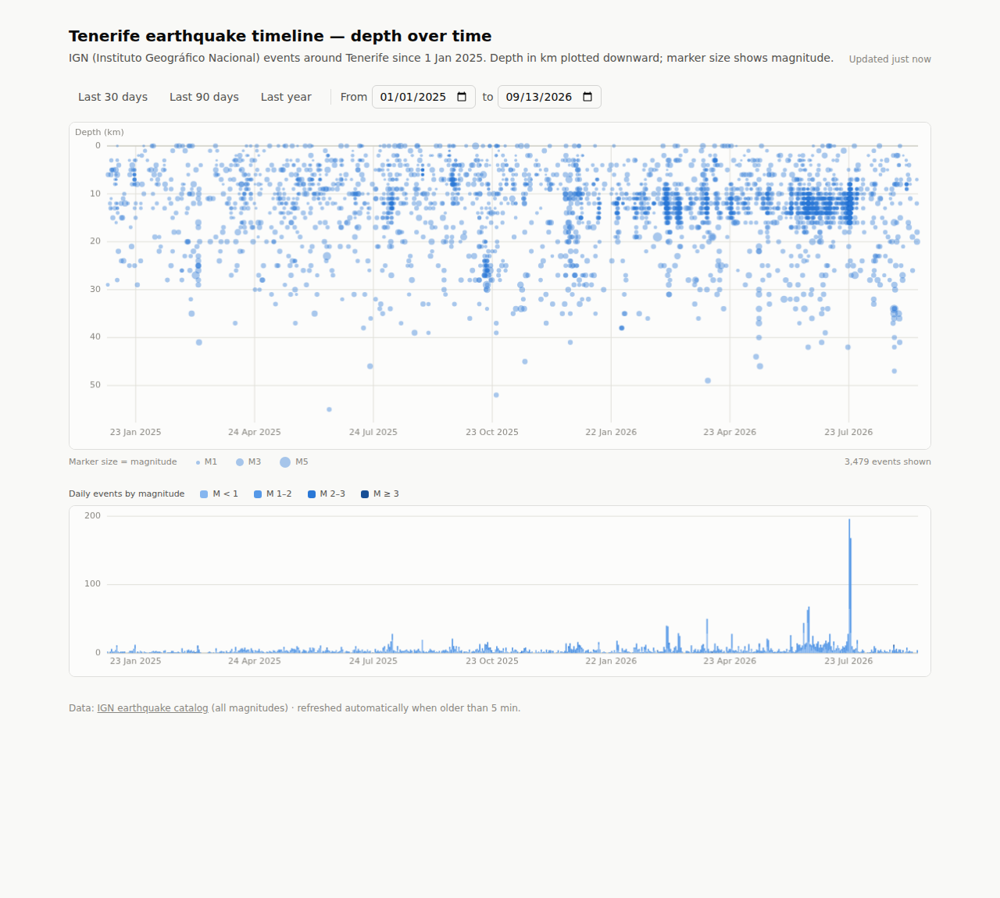

# IGN Earthquake Timeline — Tenerife

A React Router web app that visualizes the IGN earthquake catalog for the
region immediately around Tenerife as a timeline: **event depth (km) plotted
downward against time, with marker size showing magnitude**. Backed by
Postgres via Prisma.



## How it works

- Stale-while-revalidate: on page load the app **renders whatever is already
  in the database immediately** — no waiting on the upstream source.
- If the last successful refresh is older than **`REFRESH_INTERVAL_MINUTES`
  (default 5)**, the page kicks off a background `POST /api/refresh`, which
  queries the [IGN earthquake catalog](https://www.ign.es/web/ign/portal/sis-catalogo-terremotos)
  for events since the newest stored one (with a one-day overlap) and inserts
  anything new. When it lands, the chart revalidates and picks up the new
  points. No cron or scheduler is needed anywhere.
- The catalog search endpoint returns **all magnitudes** (down to M0.0 and
  negative) as GeoJSON, unlike the "últimos terremotos" feed, which only
  lists larger events (roughly M ≥ 1.5). Times are UTC.
- Refreshes are throttled server-side (interval + a concurrency lock) and
  logged in the `RefreshLog` table; failures degrade gracefully to the
  stored data.
- Events are restricted to a bounding box around **Tenerife** (island plus
  nearby offshore, including the Enmedio seamount area); the initial load
  starts at **1 Jan 2025**. Both are configurable via `INITIAL_LOAD_FROM`,
  `REGION_BBOX`, and `REGION_NAME` in `.env` — see `.env.example` and
  `app/lib/config.server.ts`. Everything stored is shown, so backfilled
  history appears automatically.
- Two charts share the same time-range selection (presets or a custom
  from/to date range): the depth-over-time scatter, and a stacked bar chart
  of daily event counts bucketed by integer magnitude.

## Stack

- [React Router](https://reactrouter.com/) (framework mode, SSR)
- [Tailwind CSS](https://tailwindcss.com/) v4
- [Prisma](https://www.prisma.io/) v7 (`@prisma/adapter-pg`) + PostgreSQL
- Canvas-based scatter plot (no chart library), light/dark aware

## Getting started

Requires Node 20+ and Docker.

```bash
cd app
docker compose up -d       # Postgres 16 on localhost:5432
cp .env.example .env       # DATABASE_URL (defaults match docker-compose)
npm install
npm run db:setup           # apply migrations + initial IGN load since 1 Jul 2026
npm run dev                # http://localhost:5173
```

The initial load needs network access to `www.ign.es`. If it fails (or you
skip it), the app still works: the first page view triggers the same load in
the background.

## Scripts

| Script | What it does |
|---|---|
| `npm run dev` | dev server with HMR |
| `npm run build` / `npm start` | production build / serve |
| `npm run db:up` | start the docker-compose Postgres |
| `npm run db:migrate` | create/apply migrations in dev |
| `npm run db:setup` | `migrate deploy` + initial IGN load |
| `npm run db:seed` | initial IGN load (idempotent, skips duplicates) |
| `npm run db:backfill` | backfill older history (see below) |
| `npm test` | unit tests for the feed parser and region/window filters |
| `npm run typecheck` | route typegen + `tsc` |

## Backfilling older history

The initial load starts at `INITIAL_LOAD_FROM` (default 1 Jan 2025). To reach
further back at any time:

```bash
npm run db:backfill                        # fill INITIAL_LOAD_FROM → oldest stored event
npm run db:backfill -- --from 2020-01-01   # reach further back
npm run db:backfill -- --from 2020-01-01 --to 2022-06-30
```

Long ranges are fetched in ≤180-day chunks; inserts are deduplicated, so
overlapping or repeated runs are safe. The app displays whatever is stored,
so backfilled events show up on the next page load. Point `DATABASE_URL` at
the production database (e.g. the Supabase session pooler) to backfill it.

## Deploying to Vercel + Supabase

The app is a standard React Router SSR app, so it deploys to Vercel with the
database on Supabase Postgres.

### 1. Create the Supabase database

1. Create a project at [supabase.com](https://supabase.com) and note the
   database password.
2. In the dashboard, open **Connect** and copy the **Session pooler**
   connection string (IPv4-friendly, works for both migrations and the app):

   ```
   postgresql://postgres.<project-ref>:<password>@aws-0-<region>.pooler.supabase.com:5432/postgres
   ```

### 2. Migrate and run the initial load (from your machine)

```bash
cd app
DATABASE_URL="<session-pooler-url>" npm run db:setup
```

This applies the Prisma migrations and pulls the initial IGN load (since
`INITIAL_LOAD_FROM`, Tenerife region) straight into Supabase. Re-running it is
safe — the load skips duplicates.

### 3. Deploy the app on Vercel

1. Import the GitHub repository in Vercel.
2. Set **Root Directory** to `app` (this is a monorepo). Vercel auto-detects
   the React Router framework; the default build command (`npm run build`) is
   correct, and `postinstall` regenerates the Prisma client during the build.
3. Add the environment variable `DATABASE_URL` = the same session-pooler URL
   (plus `INITIAL_LOAD_FROM` / `REGION_BBOX` / `REGION_NAME` if you want
   non-default values).
4. Deploy.

### Notes

- **Function duration**: the background refresh (`POST /api/refresh`) calls
  the IGN feed with a 30 s timeout, so give functions headroom — set
  **Settings → Functions → Max Duration** to 60 s (or add a `vercel.json`
  with `{"functions": {"**": {"maxDuration": 60}}}`) if your plan defaults
  lower.
- **Refresh cadence**: refreshes are triggered by page views (stale-while-
  revalidate, throttled to `REFRESH_INTERVAL_MINUTES` server-side). With zero
  traffic the data simply stays put until the next visit — no cron needed.
- **Connection pooling**: each serverless instance opens its own small pg
  pool, which the session pooler absorbs at this app's scale. If you ever
  see connection-limit errors under load, switch `DATABASE_URL` to the
  **Transaction pooler** string (port `6543`) for the Vercel env var — but
  keep using the session-pooler URL for running migrations.
- If Vercel fails to detect the framework (older accounts), install the
  preset and redeploy:

  ```bash
  npm install @vercel/react-router
  ```

  ```ts
  // react-router.config.ts
  import { vercelPreset } from "@vercel/react-router/vite";
  export default { ssr: true, presets: [vercelPreset()] } satisfies Config;
  ```

## Data model

- `Earthquake` — one row per IGN event (`id` is the IGN event code, e.g.
  `es2021xqtyi`), with origin time (UTC), lat/lon, depth (km), magnitude and
  type, max intensity, and region name.
- `RefreshLog` — one row per refresh attempt (`running`/`success`/`error`);
  the newest successful entry drives the once-per-hour staleness check.

## Notes

- Data comes from the catalog search's download endpoint
  (`app/lib/ign.server.ts`): a single stateless **multipart** POST with the
  bounding box, date range, and `tipoDescarga=geojson` returns every matching
  event in one response — the same export as the search page's download
  button (which also offers csv/txt/kmz). No pagination needed (the HTML
  search results are paginated 50 at a time; the download is not).
- The initial load and every refresh query from the newest stored event
  (minus one day of overlap, deduplicated on insert) or from
  `INITIAL_LOAD_FROM` on an empty database.
- Events outside the region box or before the window start are dropped at
  insert time, and the loader filters on the same bounds, so changing the
  config narrows the view immediately without a reload of old data.
- `magType` stores IGN's numeric magnitude-type code from the catalog (e.g.
  `4` = mbLg); the parsing is covered by `tests/ign-parse.test.ts`.
